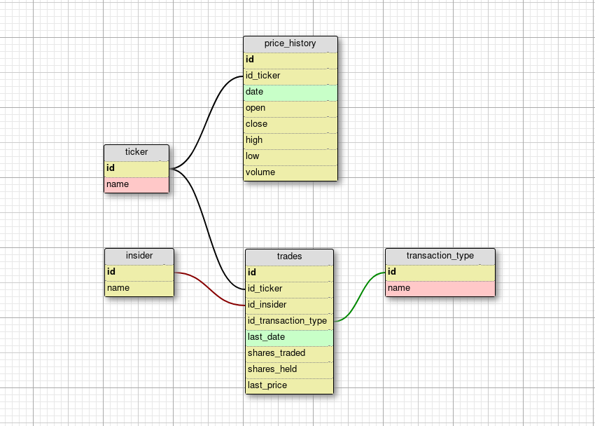

### Trading scrapper and analyser on API and WEB interfaces
###### example for nasdaq.com  

##### Install  
```sh  
pip install -r requirements.txt  
export FLASK_APP=app.py  
```  
before other commands
  
##### DB migrate:  
```sh  
flask db init  
flask db migrate  
flask db upgrade  
```  
  
##### Get start  
```sh  
flask run  
```  
  
##### Scraping  
use after migrate
  
```sh  
flask scraping  
```  
show options:
  
```sh  
flask scraping --help  
```  
  
#### Database Scheme  
  
  